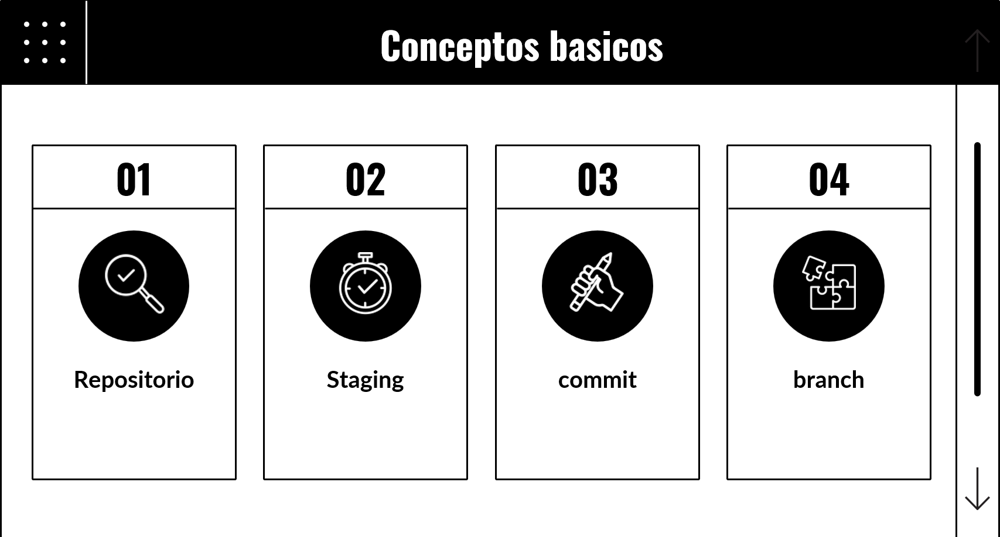

# Introducción a Git


Para entrar de lleno a esta gran herramienta, te recomendó complementar lo que vereas aqui con contenido de otros medios como los videos en mi [canal](https://www.youtube.com/channel/UCJZEPJBru50Uh7NRdDIJe-w) y la [documentación oficial](https://git-scm.com/doc) de git.

> Observación: Es recomendable igualmente que tengas algunos conocimientos previos del uso de la terminal de tu sistema operativo o conocimientos utilizando terminales basadas en unix (Linux/mac).

## Historia y creación de Git

Hoy en día, Git es, sin duda, la herramienta más utilizada en el mundo para controlar las versiones de software. Fue creada en 2005 por [Linus Torvalds](https://es.wikipedia.org/wiki/Linus_Torvalds), el famoso desarrollador del núcleo de Linux, y se ha convertido en un proyecto de código abierto muy popular y activamente mantenido. Muchos proyectos de software, tanto comerciales como de código abierto, dependen de Git. Además, es común encontrar desarrolladores familiarizados con Git, ya que se utiliza en una amplia variedad de sistemas operativos y entornos de desarrollo.

Git funciona de manera diferente a los antiguos sistemas de control de versiones como CVS o Subversion (SVN). En lugar de tener un único lugar donde se guarda todo el historial de versiones del software, cada copia de trabajo del código de un desarrollador en Git es también un repositorio completo con todo el historial de cambios. Esto se debe a que Git es un sistema de control de versiones distribuido (DVCS, por sus siglas en inglés).

Git está diseñado para ser rápido, seguro y flexible, lo que lo hace ideal para una gran variedad de proyectos de software.

### Conceptos básicos: repositorio, commit, branch



Para empezar en git necesitaremos primeramente dos cosas, Comprender algunos conceptos basicos y como poder empezar a trabajar con git.

A continuación te explicare los conceptos que debes de tener en mente para empezar a familiarizarte con git.

### Términos Básicos en Git

#### Repositorio

**Definición**:
Un repositorio es un almacén de datos que contiene todas las versiones del código fuente de un proyecto, así como el historial de cambios. Es el núcleo donde se guarda toda la información sobre el proyecto, incluidos archivos, directorios, y metadatos sobre las revisiones.

Cuando estas en tu ordenador y empiezas a trabajar en algunos proyecto o tarea, regularmente creas una carpeta (también llamado directorio) y empiezas añadir y quitar cosas de este.
Cuando terminas, aveces guardas copias de tu carpeta por seguridad, para tener diferentes versiones del proyecto o para tener un punto de partida por si algo sucede.
Con Git ya no es necesario eso, git te ayudara a gestionar tu proyecto y tener un *control de versiones* de tu carpeta.

Cuando una carpeta/directorio quieres que git participe en la gestión de esta, debes indicarlo. El comando para ello sera algo como:

```bash
git init
 ```

Cuando esto suceda, podemos llamar a nuestra carpeta, 'repositorio'. También se usa la expresión 'inicializar repositorio' cuando recién hacemos tal acción.

#### Commit

**Definición**:
Un commit es una instantánea de los cambios realizados en el proyecto en un momento específico. Cada commit registra el estado del repositorio en ese punto, incluyendo qué archivos fueron modificados y un mensaje descriptivo que explica el propósito del cambio.

Imagínate que estás escribiendo un libro. Cada vez que completas un capítulo, haces una copia de seguridad con una nota que dice "Capítulo 1 terminado". En Git, esta copia de seguridad es como un commit. Permite que, si en algún momento decides cambiar algo en el capítulo 1, puedas volver a la versión original si es necesario.


#### Staging Area (Área de Preparación)

**Definición**:
El **staging area** o **index** en Git es una etapa intermedia donde los cambios en los archivos se preparan antes de hacer un commit. Cuando añades cambios al staging area, estás creando una instantánea de estos cambios que se incluirán en el próximo commit. Esta área te permite revisar y organizar los cambios que deseas confirmar, proporcionando un mayor control sobre el proceso de commits.

Regresando al ejemplo del libro, imagina que antes de guardar una nueva versión del libro, puedes querer revisar todas tus correcciones para asegurarte de que son correctas. El staging area es como una mesa donde colocas todas tus correcciones para revisarlas antes de incluirlas en la versión final del libro. Una vez que estás satisfecho con las correcciones, las pasas a la versión final (el commit).

##### Importancia del Staging Area

El staging area es crucial para mantener un control preciso y organizado sobre los cambios en tu proyecto. Te permite revisar y validar los cambios antes de hacer un commit, asegurando que solo los cambios correctos y deseados se confirmen en el historial del proyecto. Esto es especialmente útil en proyectos grandes o colaborativos, donde la claridad y precisión en el historial de cambios son esenciales para la coordinación y el mantenimiento del código.

#### Branch

**Definición**:
Una branch (rama) es una bifurcación en el desarrollo del proyecto. Permite trabajar en nuevas funcionalidades o corregir errores de forma aislada sin afectar la rama principal (generalmente llamada main o master). Las ramas pueden fusionarse de nuevo en la rama principal una vez que los cambios estén listos y probados.

Supongamos que estás construyendo una casa. La rama principal es el diseño original de la casa. Si decides añadir una piscina, en lugar de cambiar el diseño original, haces una copia y trabajas en el diseño de la piscina por separado. Una vez que estás satisfecho con el diseño de la piscina, integras estos cambios en el diseño original. En Git, este proceso de trabajar en un diseño separado y luego combinarlo con el diseño original es como usar ramas.

#### Remote

**Definición**:
Un remote (repositorio remoto) es una versión del repositorio que se guarda en un servidor o servicio externo como GitHub, GitLab o Bitbucket. Permite a los desarrolladores colaborar en un proyecto al sincronizar sus repositorios locales con el remoto, facilitando el trabajo en equipo y la integración continua.

Imagina que tienes una biblioteca personal en casa, pero también una copia de esta biblioteca en una biblioteca pública. La biblioteca personal es tu repositorio local y la biblioteca pública es el repositorio remoto. Puedes tomar un libro de tu biblioteca personal, hacer anotaciones y luego actualizar la copia en la biblioteca pública para que otros también puedan ver y colaborar con tus cambios.

Estos términos son fundamentales para entender cómo funciona Git y cómo puede facilitar el desarrollo colaborativo de software. Con estos conceptos, puedes gestionar mejor tus proyectos, mantener un historial claro de los cambios y trabajar eficientemente con otros desarrolladores.


## Instalación de Git

Esta herramienta puede adquiriese ya sea con ayuda de ``gestores de paquetes`` como lo es winget en windows, Homebrew en macOS y en linux con usar el gestor nativo de tu distro basta.

En cualquier caso, esta el sitio oficial de git, donde podemos documentarnos y explorar todas las formas de poder instalar git.

Enlace: https://www.git-scm.com/downloads

### Instalación en Windows

- **Usando el instalador de git.** Ingresando al link anterior, veremos en grande un botón para darle a descargar para windows. le damos clic y buscamos el ejecutable que nos servirá para nuestro equipo; instalamos tal ejecutable, no es necesario hacer alguna configuración previa, nosotros la veremos mas adelante.

- **Con winget.** Ejecutamos ya sea con la terminal de cmd o powershell el siguiente comando:

```bash
winget install --id Git.Git -e --source winget
```
>Nota. En caso de querer actualizar tu version de git, en windows podrias escribir el comando: `git update-git-for-windows` para versiones de git 2.16.1 en adelante.

### Instalación en macOS

debes tener previamente instalado Homebrew. Puedes instalarlo con el siguiente comando desde tu terminal:

```bash
/bin/bash -c "$(curl -fsSL https://raw.githubusercontent.com/Homebrew/install/HEAD/install.sh)"
```

Ahora con Homebrew instalado, puedes ejecutar el comando:

```bash
brew install git
```

### Instalación en linux

Por temas historicos, git ya viene en tu equipo. Si quieres verificarlo escribe `git --version`. Si por alguna razón no lo tienes, solo escribe en la terminal (si eres usuario de debian/ubuntu):

```bash
apt-get install git
```

Para consultar la instalación de otros distros con gestores diferentes de paquetes, mira el enlace que te tenemos al principio de este tema.

## Configuración Inicial

Los comandos iniciales que veras a continuación deberas configurarlo dependiendo de cual sea tu sistema operativo y tus preferencias. Estos comandos debes escribirlos desde tu terminal preferida, aconsejable en el caso de windows usar la terminal git-bash que viene instalada con git.

1. **git --version**:
   - **Argumento**: `--version`
   - **Descripción**: Muestra la versión de Git instalada en tu sistema.
   - **Ejemplo de uso**:

     ```bash
     git --version
     ```

     Este comando muestra la versión actual de Git instalada en tu computadora.

2. **git config --global user.name**:
   - **Argumento**: `--global user.name`
   - **Descripción**: Establece el nombre de usuario global para Git.
   - **Ejemplo de uso**:

     ```bash
     git config --global user.name "Tu Nombre"
     ```

     Este comando configura tu nombre de usuario global para Git como "Tu Nombre". Este nombre se utilizará en todos los repositorios si no se especifica uno localmente.

3. **git config --global user.email**:
   - **Argumento**: `--global user.email`
   - **Descripción**: Establece la dirección de correo electrónico global asociada con tu cuenta de Git.
   - **Ejemplo de uso**:

     ```bash
     git config --global user.email "tu_email@example.com"
     ```

    Este comando configura tu dirección de correo electrónico global para Git como "tu_email@example.com". Se utiliza para identificar tus commits.

4. **git config --global core.editor "code --wait"**:
   - **Argumento**: `--global core.editor`
   - **Parámetro**: `"code --wait"`
   - **Descripción**: Configura el editor de texto utilizado por Git para editar mensajes de commit.
   - **Ejemplo de uso**:

     ```bash
     git config --global core.editor "code --wait"
     ```

     Este comando configura Visual Studio Code como tu editor para Git, con la opción `--wait` para que Git espere a que se cierre Visual Studio Code antes de continuar.

5. **git config --global init.defaultbranch main**:
   - **Argumento**: `--global init.defaultbranch`
   - **Parámetro**: `main`
   - **Descripción**: Define la rama predeterminada al inicializar un nuevo repositorio.
   - **Ejemplo de uso**:

     ```bash
     git config --global init.defaultbranch main
     ```

     Este comando establece `main` como la rama predeterminada que se creará automáticamente al inicializar un nuevo repositorio en Git.

6. **git config --global core.autocrlf [opción]**:
   - **Argumento**: `--global core.autocrlf`
   - **Parámetro**: `[opción]` (por ejemplo, `true`, `false`, `input`)
   - **Descripción**: Configura cómo Git maneja los saltos de línea en los archivos.
   - **Ejemplo de uso**:

     ```bash
     git config --global core.autocrlf true
     ```

     Este comando configura Git para convertir automáticamente los saltos de línea a CRLF al hacer checkouts en Windows y a LF al hacer checkouts en macOS/Linux. Es útil para mantener la coherencia en los archivos entre diferentes sistemas operativos.

7. **git config --global --editor**:
   - **Argumento**: `--global --editor`
   - **Descripción**: Este comando **nos permitirá ver todas las configuraciones que hemos llevado acabo**, si lo hicimos de la manera correcta. De hecho, a partir de ahora, podrías modificar las configuraciones antes hechas si asi lo prefieres por este mismo archivo. En este mismo podríamos añadir unos cuantos *alias* especiales para git y hasta algunas cosas adicionales.
