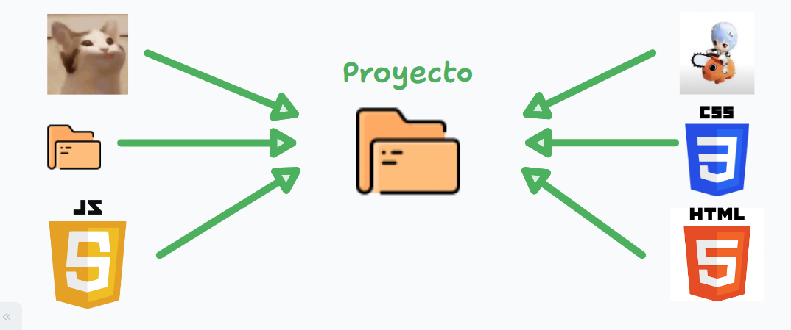

# Empezando con Git

Si ya has instalado git y todo a funcionado correctamente, felicidades!. Ahora continuación, te explicare cómo empezar a usar Git, desde la creación de un repositorio hasta el flujo de trabajo básico.

## Creación de un Repositorio

En este punto, ya hice mención de que es un repositorio en el [modulo 1](./Modulo_1.md/#conceptos-básicos-repositorio-commit-branch), pero daré una explicación mas explicita de este mismo.

>Nota. Cuando se haga mención de la palabra directorio, nos estamos refiriendo a una carpeta. Solo que en Linux es utilizado mas dicha palabra para referirse a estas y git hederá esto mismo.

Cuando empiezas un proyecto o un trabajo en tu ordenador, creas un directorio y añades elementos dentro de este. Dicha carpeta estará en nuestro ordenador y cuando trabajamos en el, estamos en un entorno local, es decir, los cambios que hagamos solo se verán reflejados en nuestro ordenador.

Nuestro proyecto solo sera afectado por las acciones que realicemos en este y nadie sabrá lo que hemos modificado, eliminado o excluido, y por ende no sera nada fácil llevar un control de este a largo plazo. Para esto esta git, que nos ayudara a esto mismo.

Para indicarle a git que se una a nuestro proyecto lo aremos con ayuda de la terminal.
Si estamos en windows es recomendable que para evitar conflictos con los comandos y explicaciones, utilices la terminal instalada con git `git bash`, en el caso de Linux y mac, con usar la terminal por defecto, no hay problema.

### Crear un Repositorio Local

Ahora en nuestra terminal a modo de ejemplo crearemos una carpeta llamada proyecto, esto lo hacemos escribiendo en la terminal lo siguiente:

```bash
mkdir "proyecto"
```

``mkdir` es el comando utilizado para crear directorios (make directory) y a este le debemos indicar el nombre, el cual en mi caso es proyecto.

Para empezar que git se una a nuestro proyecto, debemos ingresar dentro de tal carpeta, pero desde la terminal, ¿cómo?, con el comando `cd`:

```bash
cd "proyecto"
```

Ahora solo debemos escribir lo siguiente para que git inicialice en nuestro proyecto

```bash
git init
```

A partir de ahora, nuestro proyecto como tiene a git dentro, se le es nombrado como un *repositorio*. También es posible que llegues a escuchar la expresión "inicializar el repositorio", pues precisamente es lo que acabamos hacer con `git init`.

## Comandos de Terminal

A partir de ahora debes estar familiarizado con al menos algunos comandos elementales que se utilizan en la gestión de archivos, carpetas y de mas elementos desde una terminal.
De momento solo explicare comandos básicos para empezar a trabajar con git, pero si deseas profundizar mas en esto, puedes unirte a nuestra comunidad de discord.

La sintaxis general para ingresar las instrucciones por nuestras terminales es la siguiente:

```plaintext
comando [opciones] [argumentos]
```

- **comando**: El nombre del programa o comando que deseas ejecutar. Por ejemplo, `git`, `ls`, `cp`, etc.
- **opciones** (o flags): Modificadores que alteran el comportamiento del comando. Generalmente, comienzan con uno o dos guiones (`-` o `--`).
  - **Opciones de un solo guion**: Usualmente se combinan múltiples flags en una sola cadena.
    - Ejemplo: `-a` (opción única), `-la` (combina `-l` y `-a`).
  - **Opciones de doble guion**: Normalmente son palabras completas y más descriptivas.
    - Ejemplo: `--help`, `--version`.
- **argumentos**: Parámetros adicionales que especifican las entradas del comando, como archivos, directorios o valores específicos.

los comandos que mas empezaremos a utilizar serán los siguientes:

| Comando   | Explicación Breve                                          | Ejemplo de Uso                   |
| --------- | ---------------------------------------------------------- | -------------------------------- |
| `pwd`     | Muestra la ruta completa del directorio actual             | `pwd`                            |
| `clear`   | Limpiara todo el texto de la terminal                      | `clear` `atajo: ctrl + L`        ñ|
| `cd`      | Cambia el directorio actual                                | `cd /ruta/a/directorio`          |
| `ls`      | Lista el contenido del directorio                          | `ls -l`                          |
| `mkdir`   | Crea un nuevo directorio                                   | `mkdir nuevo_directorio`         |
| `touch`   | Crea un archivo vacío o actualiza la fecha de modificación | `touch archivo.txt`              |
| `rm`      | Elimina archivos o directorios                             | `rm archivo.txt`                 |
| `mv`      | Mueve o renombra archivos y directorios                    | `mv archivo.txt nueva_ubicación` |
| `cp`      | Copia archivos o directorios                               | `cp archivo.txt copia.txt`       |
| `history` | Muestra el historial de comandos                           | `history`                        |

### Desglose de Comandos

1. **`pwd` (Print Working Directory)**
   - **Explicación**: Muestra la ruta completa del directorio actual en el que te encuentras.
   - **Ejemplo**:

     ```bash
     pwd
     ```

     Salida posible: `/home/usuario/proyecto`

2. **`cd` (Change Directory)**
   - **Explicación**: Cambia el directorio actual al especificado.
   - **Ejemplo**:

     ```bash
     cd "ruta/de/tu/proyecto"
     ```

   - Es aconsejable colocar la ruta de nuestras carpetas entre comillas dobles. Si quieres complementar este comando, es muy recomendable que investigues el uso de **rutas absolutas y relativas**.
   - Si escribimos un `.` en ves de la ruta de la carpeta, hacemos alusión a nuestra carpeta. Si escribimos dos `..`, esto lo que hará es regresar un directorio atras.
   - Si no indicamos nigun directorio, este nos mandara al `home` de nuestro usuario.
   - Si colocamos `-` este producirá un efecto similar a los dos puntos.

3. **`ls` (List)**
   - **Explicación**: Lista el contenido del directorio.
   - **Ejemplo**:

     ```bash
     ls -l
     ```

     - **flags**:
     - `-l`. En lista con información adicional de escritura, lectura ect de nuestros archivos.
     - `-a`. Muestra todos los elementos, incluso los ocultos.
     - Un comando que te ayudaría si quieres solo mostrar directorios podría ser el `ls -d */`.

4. **`mkdir` (Make Directory)**
   - **Explicación**: Crea un nuevo directorio con el nombre especificado.
   - **Ejemplo**:

     ```bash
     mkdir nuevo_directorio
     ```

   - Si quieres añadir nombres de carpetas con espacios, solo debes escribir el nombre entre comillas, ejemplo `mkdir "nuevo proyecto"`
  
5. **`touch`**
   - **Explicación**: Crea un archivo vacío o actualiza la fecha de modificación de un archivo existente.
   - **Ejemplo**:

     ```bash
     touch archivo.txt
     ```

   - En si, para este comando, no es necesario especificar la extension del archivo a crear, pero si aconsejo que si solo sera texto plano le indiques la terminación .txt.
   - Un comando similar a este es el llamado `cat`, pero cat solo muestra el texto de los documentos creados por ejemplo con touch. Podríamos hacer uso de la *redireccion de salida* para crear un archivo a propósito de la siguiente forma `cat > archivo.txt`.

6. **`rm` (Remove)**
   - **Explicación**: Elimina archivos o directorios.
   - **Ejemplo**:

     ```bash
     rm archivo.txt
     ```

     Para eliminar un directorio y su contenido recursivamente:

     ```bash
     rm -r directorio
     ```

   - Si al intentar eliminar el directorio no funciona `-r`, usar entonces ``-rf`.

7. **`mv` (Move)**
   - **Explicación**: Mueve o renombra archivos y directorios.
   - **Ejemplo**:

     ```bash
     mv archivo.txt nueva_ubicación/
     ```

     Para renombrar un archivo:

     ```bash
     mv archivo.txt nuevo_nombre.txt
     ```

8. **`cp` (Copy)**
   - **Explicación**: Copia archivos o directorios.
   - **Ejemplo**:

     ```bash
     cp archivo.txt copia.txt
     ```

     Para copiar un directorio y su contenido recursivamente:

     ```bash
     cp -r directorio/ copia_directorio/
     ```

9. **`history`**
   - **Explicación**: Muestra el historial de comandos ejecutados en la terminal.
   - **Ejemplo**:

     ```bash
     history
     ```

### Uso de Ayuda y Manuales

Para obtener más información sobre un comando y sus opciones, puedes usar:

- `--help` o `-h`:
  - Proporciona información de ayuda sobre el comando.
  - Ejemplo: `git --help`, `ls --help`.
- `man` (manual):
  - Abre el manual completo del comando.
  - Ejemplo: `man git`, `man ls`.
  - Nota. El comando `man` en git bash no existe. En su defecto utilice help o la [documentación oficial](https://man7.org/linux/man-pages/man1/man.1.html) de man.

Para empezar a utilizar git en la terminal, ya vimos que se emplea el comando `git` y seguido de este le hemos indicado flags y argumentos que son utilices. A partir de ahora estas listo para empezar a trabajar en git.

## Flujo de Trabajo Básico

El flujo de trabajo básico en Git implica realizar cambios en tu proyecto, añadir esos cambios al área de staging, hacer commits y finalmente, enviar esos commits al repositorio remoto. Empecemos por lo mas elemental

### Primera etapa. Repositorio



En esta primera etapa nos toparemos con empezar nuestro proyecto. Es aquí cuando recién creamos nuestro directorio, añadimos elementos como imágenes, archivos, y mas carpetas. Para que git empiece a trabajar en nuestro proyecto escribimos estando dentro de dicha carpeta en la terminal el comando `git init`.

Ejemplo, podemos irnos a el escritorio en windows, crear una carpeta llamada 'proyecto' e inicializar el repositorio:

```bash
#Ingresamos a nuestro escritorio
cd Desktop
#creamos una carpeta
mkdir "proyecto"
#entramos a dicha carpeta
cd "proyecto"
#inicializamos el repositorio
git init
```

Lo siguiente es añadir archivos, podemos mover, copiar o crearlos, como deses.
Ejemplo:

```bash
#crea un archivo de texto
touch prueba.txt
```

Para conocer el estado actual de nuestro repositorio es con el comando `status`

```bash
git status
```

Esto lo que mostrara si lo ejecutamos es decirnos que es lo que esta pasando actualmente en nuestro repositorio. La salida que esperamos se debe ver asi

```bash
On branch main

No commits yet

Untracked files:
  (use "git add <file>..." to include in what will be committed)
        prueba.txt

nothing added to commit but untracked files present (use "git add" to track)
```

Esto nos indica tres cosas: Estamos en la rama principal, no existen commits aun y existen archivos sin ser darle seguimiento (untracked) que podemos mandarlos a la siguente etapa, staging. Los dos primeros puntos los explicare mejor mas adelante, por el momento continuemos con nuestros archivos.

### Segunda etapa. Staging Area

Esta es la siguiente fase por la cual debemos pasar. En esta añadiremos los archivos que pensamos que están listos para ser comprometidos y por ende que git genere un punto de guardado de estos. De momento si pensamos que estos archivos queremos tener una version preliminar, es aquí cuando podemos guardarlos en staging.

con `git status` sabemos cuales son los archivos sin darle seguimiento aun por parte de git, para indicarle que queremos pasar a el area de staging (area de preparación) ejecutamos el comando `add`

```bash
git add archivo.txt
```

A este comando le podemos indicar el nombre de nuestro archivo a ser comprometido. Si en dado caso de tener varios, podemos añadirlos uno por uno como en el ejemplo anterior, pero supongamos que tenemos otro archivo, podemos indicarle a git que añada los dos a staging

```bash
git add archivo.txt archivo2.txt
```

Si quisiéramos añadir todo el contenido de nuestro repositorio, podemos hacerlo con el signo de asterisco.

```bash
git add *
```

Un efecto similar a este, seria colocar un punto `.`; difieren en que el punto también tendrá en cuenta archivos modificados. Eso lo exploraremos mas adelante.

```bash
#Ejemplo
git add .
```

si escribimos `git status` dirá que existen cambios por ser comprometidos (mandarlos a un commit)

```bash
On branch main

No commits yet

Changes to be committed:
  (use "git rm --cached <file>..." to unstage)
        new file:   prueba.txt
        new file:   prueba2.txt
```

### Tercera etapa. Commit

Si estamos seguros de que nuestros archivos estan listos para ser registrados oficialmente por git, y por ende generar un punto de guardado, es hora de pasar a la etapa de "comitiar" o mejor dicho, comprometer nuestro archivos.

Para esta tarea, tenemos el comando `commit`

```bash
git commit -a
```

Esto hara que se abra el editor que configuramos en un inicio, y en este mismo escribiremos el mensaje con el cual queremos que se cree el registro de dicho commit. Con esto intentamos indicar el motivo de dicho commit o la implicacion de este, digamos que como recien creamos el repositorio, inicialmente es normal indicarle a git que este primer commit sera nombrado
'init repository' o 'inicializando repositorio'. Guardamos el documento y cerramos el editor y veremos que nos mostrara una salida similar a esta

```bash
[main (root-commit) c78c57a] init repo
 2 files changed, 0 insertions(+), 0 deletions(-)
 create mode 100644 prueba.txt
 create mode 100644 prueba2.txt
```

Esto indica que se a creado tal cual el commit con un numero de identificación y se añadieron dos archivos.

si hicimos todo bien, veremos que al escribir git status nos muestra lo siguiente

```bash
On branch main
nothing to commit, working tree clean
```

Como sugerencia, también es posible añadir el contexto o nombre del commit desde la misma terminal, esto dando el argumento `-m`. Personalmente prefiero mas este método, pero eres libre de utilizar el que mejor se te acomode.

```bash
git commit -m "inicializando repositorio"
```

El flujo final basico se veria algo asi:


Primero creamos el repositorio `git init`, después añadimos elementos. Los pasamos a staging con `git add` y al final, hacemos un punto de guardado de los archivos que estaban en staging con `git commit`.
